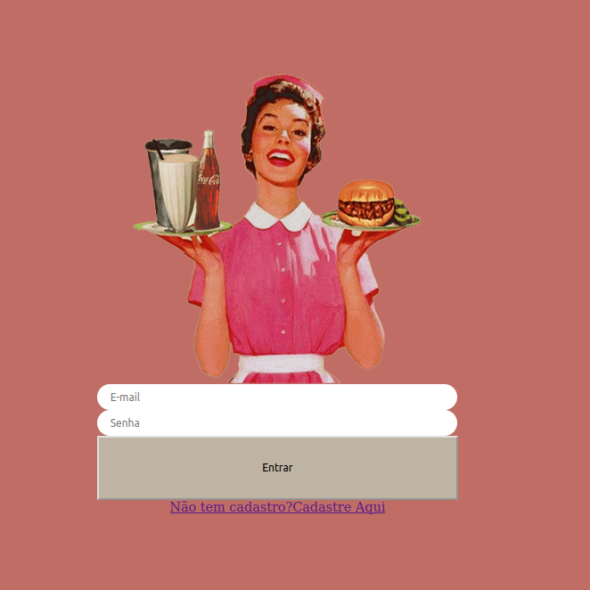
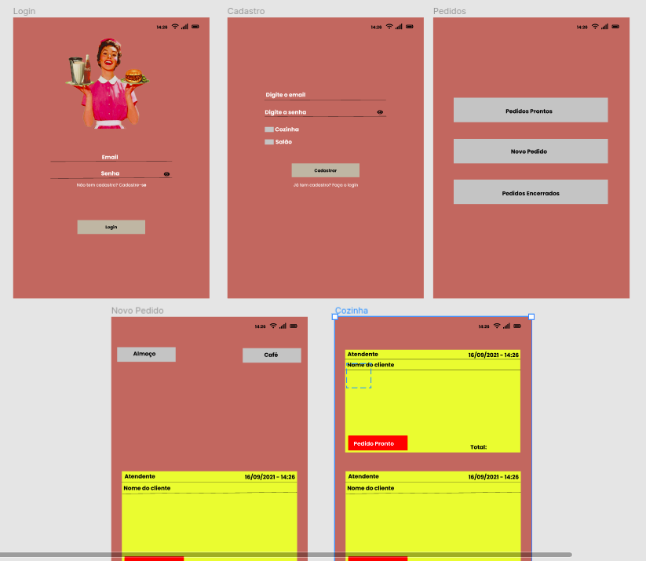
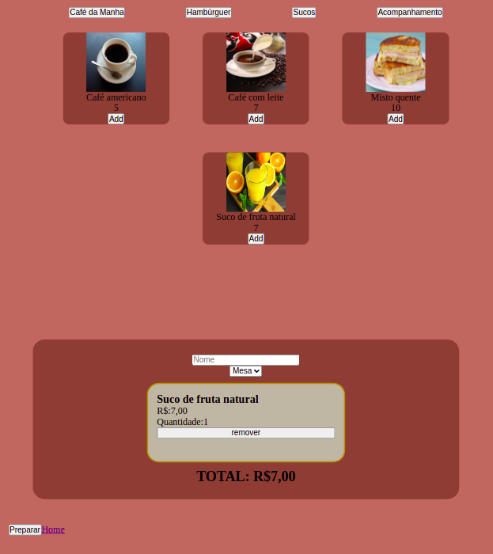
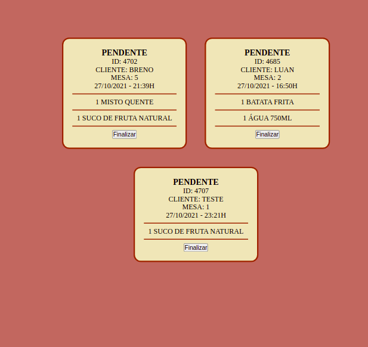

# Pinup Burguer

## Índice

- [1. Sobre o projeto](#1-sobre-o-projeto)
- [2. Historias de usuários](#2-sobre-o-tema)
- [3. Layout](#3-experiência-dos-usuários)
- [4. Paleta de cores](#4-layout)
- [5. Objetivos de Aprendizagem](#5-conteúdo)
- [6. A Aplicação](#6-comecando)
- [7. A Autora](#6-autora)

## 1. Sobre o projeto

Pinup Burger é um pequeno restaurante de hambúrgueres, que está crescendo, e necessitava uma interface para realizar pedidos utilizando um tablet, e enviá-los para a cozinha para que sejam preparados de forma ordenada e eficiente.

## 2. Histórias de usuários 

Uma história do usuário é uma explicação informal e geral sobre um recurso de software escrita a partir da perspectiva do usuário final. Seu objetivo é articular como um recurso de software pode gerar valor para o cliente.

Primeira História de Usuário

    Quero cadastrar meus funcionarios. Eu, como garçom/garçonete quero entrar no sistema de pedidos.

Segunda História de Usuário

    Eu como garçom/garçonete quero poder anotar o pedido de um cliente para não depender da minha memória, saber quanto cobrar e poder enviar os pedidos para a cozinha para serem preparados em ordem.

## 3. Layout art

O processo de criação foi pensado buscando um layout intuitivo e de fácil compreensão.

## 4. Paleta de cores

Para o layout, pensamos em uma paleta de cores que remete a nostagia e minimalismo  
 

## 5. Objetivos de aprendizagem

React

    jsx

    components

    events

    lists-and-keys

    conditional-rendering

    lifting-up-state

    hooks

    css-modules

    routing

HTML

    Uso de HTML semântico

CSS

    Utilização do Sass

    Uso de seletores de CSS

    Empregar o modelo de caixa (box model): borda, margem, preenchimento

    Uso de flexbox en CSS

    Uso de CSS Grid Layout

    Uso de media queries

JavaScript

    Uso ES modules

    Uso de linter (ESLINT)

    Uso de identificadores descritivos (Nomenclatura | Semântica)

Git e GitHub

    Git: Instalação e configuração

    Git: Controle de versão com git (init, clone, add, commit, status, push, pull, remote)

    Git: Integração de mudanças entre ramos (branch, checkout, fetch, merge, reset, rebase, tag)

    GitHub: Criação de contas e repositórios, configuração de chave SSH

    GitHub: Implantação com GitHub Pages

    GitHub: Colaboração pelo Github (branches | forks | pull requests | code review | tags)

    GitHub: Organização pelo Github (projects | issues | labels | milestones | releases)

HTTP

    Solicitações o requisições (request) e respostas (response).

    Cabeçalhos (headers)

    Corpo (body)

    Verbos HTTP

    Codigos de status de HTTP

    Encodings e JSON

    CORS (Cross-Origin Re

    source Sharing)

UX (User eXperience)

    Desenhar a aplicação pensando e entendendo o usuário

    Criar protótipos para obter feedback e iterar

    Aplicar os princípios de desenho visual (contraste, alinhamento, hierarquia)

    Planejar e executar testes de usabilidade

## 6. A aplicação

Login: teste@teste.com.br
Senha: 123456

 
 

## 7. A autora

[Michele Martins](https://www.linkedin.com/in/michele-valerio-martins/)

